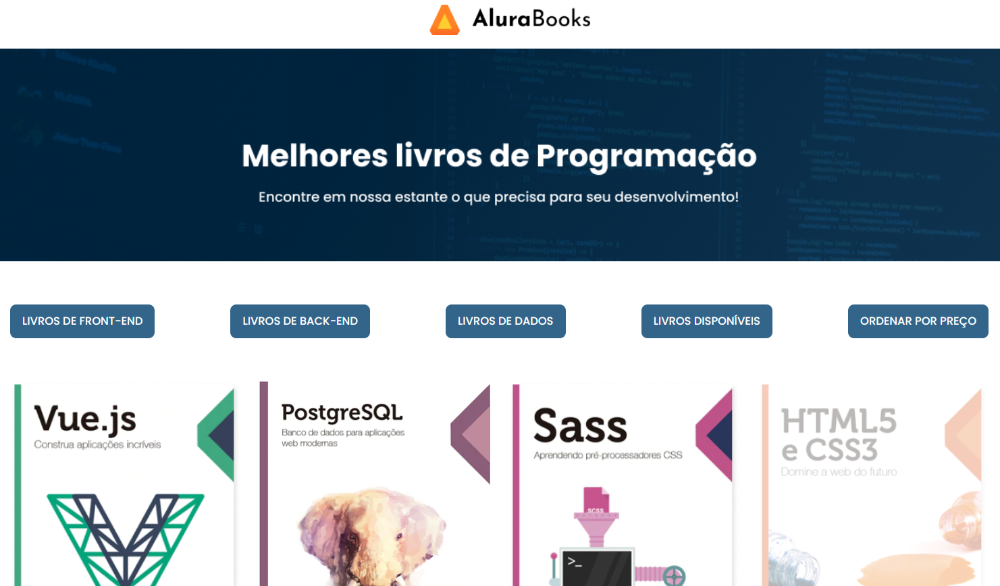
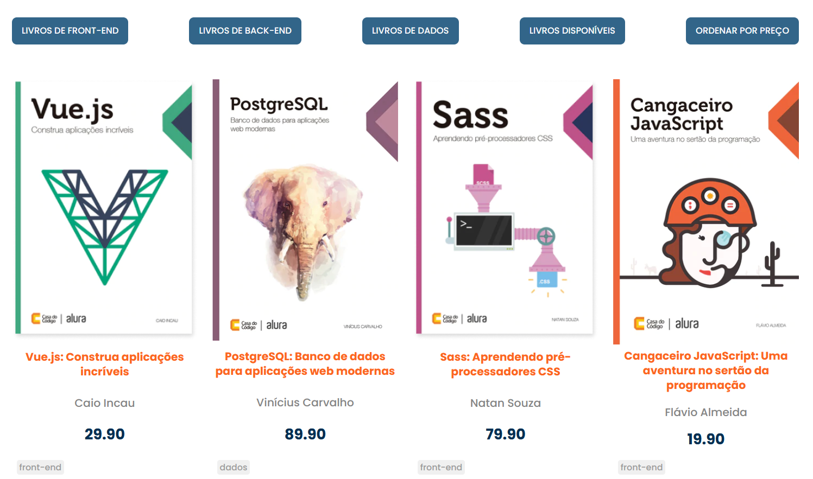
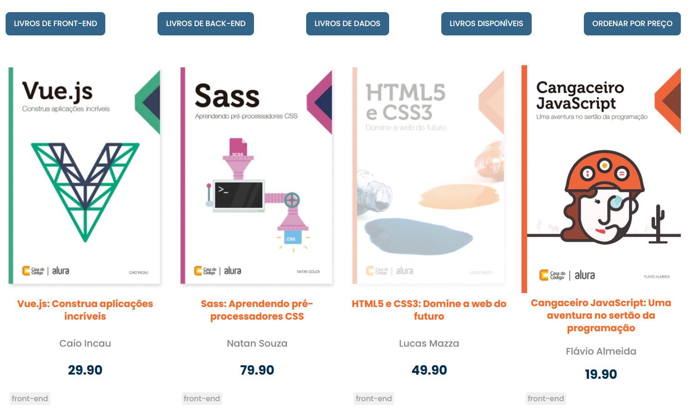

## 📚 Alura Books

O **Alura Books** é uma página que apresenta uma seleção dos melhores livros de programação vendidos pela Alura. Os livros são organizados por **categorias**, exibindo imagem, título, autor e preço, com foco na aplicação de **métodos de array do JavaScript** para manipulação dinâmica dos dados e do DOM.

 

## 🚀 Sobre o Projeto

Este projeto foi desenvolvido durante o curso da Alura:

* "JavaScript: métodos de array"

Com base em um site fictício de venda de livros, o projeto ensina como **utilizar os principais métodos de array do JavaScript para listar, filtrar, ordenar e exibir** dinamicamente os livros na tela.

## 📚 Objetivos do Curso

* Aprender a utilizar os principais métodos de array do **JavaScript**;
* Saber como aplicar uma função em todos os elementos da lista com **forEach**;
* Manipular os valores criando uma nova lista com **map** de forma prática;
* Descobrir como aplicar **ordenação e filtros** em seus projetos JavaScript;
* Manipular o DOM com base nos **métodos de array**.

## 🛠️ Tecnologias Utilizadas

## 🖼️ Visualização do Projeto

Uma prévia das principais funcionalidades do **Alura Books**:

**🌐 Acesse o Projeto Online**

O projeto está disponível para visualização na **Vercel**. Clique no link abaixo para acessar:

**🏠 Tela Inicial**

A tela inicial do Alura Books apresenta uma vitrine interativa de livros de programação.

**📖 Lista de Livros**

Os livros são exibidos dinamicamente com imagem, título, autor e valor, com base na seleção.

**🏷️ Seleção por Categoria**

O usuário pode escolher livros de diferentes categorias (como Front-End, Back-End, UX & Design).

